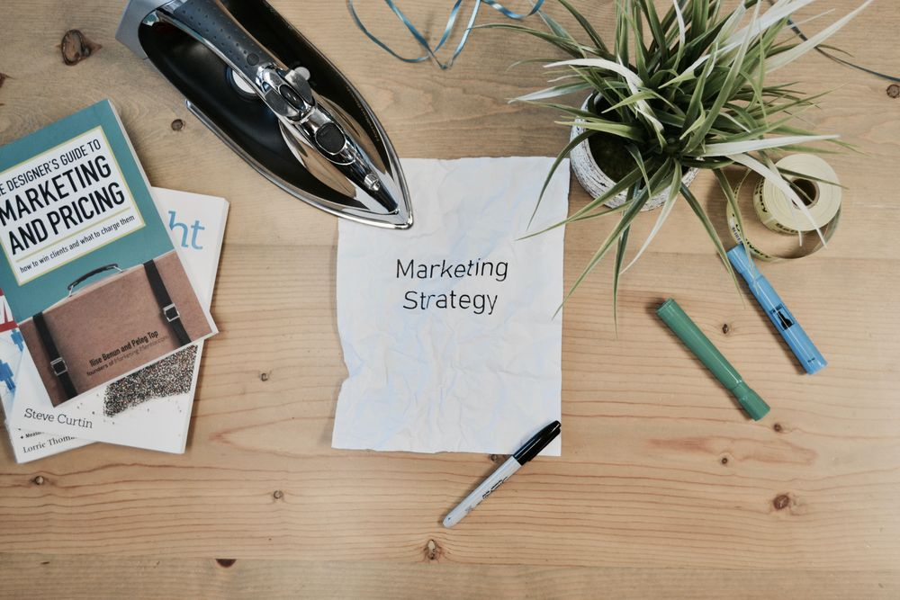

# Aufgaben des Marketings - Vergleich früher und heute

 

## 1. Einleitung
Auf Grund der Digitalisierung haben sich die Aufgaben des Marketings vor allem in den letzten zehn Jahren stark verändert. Daraus resultierend haben sich folgende Fragen ergeben: Wie hat sich der Wandel im Bereich Marketing auf den Kunden ausgewirkt? Und in wie fern haben sich die die Aufgaben im Vergleich von früher zu heute verändert? Zu Beginn sollte der Begriff Marketing definiert werden. Manfred Bruhn, Professor für Marketing erklärt diesen wie folgend: „Marketing ist eine unternehmerische Denkhaltung. Sie konkretisiert sich in der Analyse, Planung, Umsetzung und Kontrolle sämtlicher interner und externer Unternehmensaktivitäten, die durch eine Ausrichtung der Unternehmensleistungen am Kundennutzen im Sinne einer konsequenten Kundenorientierung darauf abzielen, absatzmarktorientierte Unternehmensziele zu erreichen“ (Bruhn, 2010, S. 14). Marketing umfasst also alle Bereiche eines Unternehmens, die des Absatzes, sowie Werbung, Lenkung und Beobachtung des Marktes eines Produktes. Eine weitere wichtige Definition ist der Marketer. Dabei handelt es sich um die Person, die im Unternehmen für die Vermarktung von Produkten zuständig ist (Bruhn, Grundbegriffe und -konzepte im Marketing, 2010).

## 2. Geschichte des Marketings
In den 50er Jahren bestand die Hauptaufgabe des Marketings (Marketing 1.0) darin die große Nachfrage an Gütern zu befriedigen, indem der Fokus hauptsächlich auf der Produktion lag. Nach dem zweiten Weltkrieg galt für Unternehmen das Prinzip „mehr ist mehr“. Auf Grund des hohen Interesses an Produkten, wurde nur wenig zusätzliche Öffentlichkeitsarbeit benötigt. In den darauffolgenden zehn Jahren wurde zunehmend Werbung über Radiosender oder im Fernsehen ausgestrahlt und somit zum Kernthema des Marketings in den 60er Jahren. Der Schwerpunkt des Marketings verlagerte sich von der Produktion hin zum Vertrieb. Durch einen immer stärker wachsenden Wettbewerb und einem kürzer werdenden Produktlebenszyklus stieg die Konkurrenz an Werbeagenturen bis in die 90er Jahre sehr stark an. Dieses Überangebot an Werbung führte zur Ignoranz in der Bevölkerung und somit mussten neue Strategien entwickelt werden. Die Erfindung des Internets machte es dem Marketing möglich schneller und einfacher viele Menschen zu erreichen, beispielweise über Emails oder über soziale Netzwerke, wie Instagram und Facebook (Kotler, Armstrong , Wong, & Saunders, 2011, S. 34 ff).

## 3. Vergleich der Marketingstrategien
Marketingkonzepte werden an die jeweiligen Bedürfnisse der Bevölkerung angepasst. Auf Grund einer stetigen Entwicklung lassen sich die Aufgaben im Marketing gut miteinander vergleichen. Früher gab es einen klaren Kommunikationsfluss, welcher vom Unternehmen ausgehend, über das Produkt und den Vertrieb bis hin zum Kunden in eine Richtung floss. Hauptaufgabe des Marketings war es, diesen Kommunikationsfluss zu ermöglichen. Dadurch besaß das Marketing alle Informationen, die von einem Unternehmen ausgingen. Heute gibt es diese strikten Kommunikationsabläufe im Marketing nicht mehr. Es besteht die Möglichkeit, dass jeder mit jedem kommunizieren kann, was bedeutet, dass beispielsweise sich der Verkäufer mit den Kunden austauscht, aber auch die Kunden untereinander. Es gibt keine klassische one-way Kommunikation mehr, sondern es entsteht ein Dialog und Netzwerke. Das Marketing kann nicht mehr alleine steuern, was kommuniziert wird, sondern nur noch über welche Kanäle kommuniziert wird.
Eine weitere Veränderung ist, dass es früher ausreichte, Kunden nur über ein Produkt zu informieren. Heutzutage hat der Kunde eine viel größere Auswahl und mehr Möglichkeiten, das Produkt zu erwerben. Mit Hilfe des Internets können Preise der Leistungen und Produkte einfach miteinander verglichen werden. Es herrscht eine extrem hohe Markttransparenz, durch die ständige Verfügbarkeit der Produkte. Des Weiteren gibt es nicht nur einen Hersteller des Produktes, sondern meistens eine Vielzahl an Unternehmen mit ähnlichen oder denselben Leistungen. Dies führt zu einem großen Konkurrenzkampf. Deshalb wird im Marketing darauf geachtet, Werbung mit mehr Emotionen zu gestalten und möglichst genau auf die Bedürfnisse der Kunden einzugehen und diese anzupassen. Man orientiert am Kunden und dessen Interessen, Anliegen und Werten der Kunden. So kann eine hohe Kundenzufriedenheit erreicht werden kann. Es wird versucht Marketing als Konzept zur Befriedigung der Käuferwünsche einzusetzen. Dabei handelt es sich um einen Prozess, welcher den gesamten Produktlebenszyklus umfasst. Durch eine stetige Verbesserung der Produkte soll der Kunde an das Unternehmen und das Produkt gebunden zu werden. Bei diesem ganzheitlichen Konzept spricht man von Marketing 3.0. Ein Marketingmanager wird heutzutage auch „Enabler der Kommunikation“ genannt. Nach dem Merriam-Webster- Dictionary ist ein Enabler ist eine Person, Gruppe oder Organisation, die jemandem ausreichende Macht, Mittel, Gelegenheit oder Autorität gibt, etwas zu tun (Merriam- Webster-Dictionary, 2019).
Daraus haben sich zwei Hauptaufgaben für Marketer ergeben - zum einen das Produktmanagement mit zielgruppenangepasster Kommunikation und zum anderen die Markenkommunikation. Die beiden Bereiche können nicht klar voneinander getrennt werden. Zu einer einwandfreien Produktkommunikation gehört ein gutes Verständnis der Bedürfnisse der Kunden und des Marktes. Markenkommunikation hat das Ziel, ein gutes Image bei den Kunden aufzubauen und das Ansehen zu verbessern. Hilfreich ist dabei, wenn Marketingmanager bei der Preisgestaltung sowie beim Design des Produktes mitentscheiden dürfen. Klassische Werbung „above-the-line“, zu welcher beispielsweise die Werbung in Zeitschriften, in Kinos oder im Fernsehen zählt, wird zunehmend durch „below-the-line“ Werbung ersetzt. Diese Art der Kommunikation beinhaltet Sponsoring, Produktplatzierungen oder Eventmarketing.
Ein weiterer Trend, welcher derzeit sehr stark wächst, ist das sogenannte Influencer- Marketing. Influencer sind Personen, welche in sozialen Netzwerken hohes Ansehen und großen Einfluss haben und somit Werbung zu bestimmten Produkten machen oder Feedback geben. Mit Hilfe dieser neuen Marketingstrategie kann eine hohe Zahl an Kunden in kürzester Zeit erreicht werden. Auf Grund der Nahbarkeit der Influencer fühlen sich Kunden stärker angesprochen als bei der klassischen Produktplatzierung. Es geht heute darum, nicht nur das Produkt zu kaufen, sondern um die Vermittlung eines Lifestyles.
Eine weitere Veränderung im Marketing ist, dass die sogenannten vier „Ps“ (product, place, promotion, price) sich zu den 3 C ́s (cocreate value, communicate value, capture value) weiterentwickelt haben. Hierbei wird der Kunde auch wieder mehr in den Mittelpunkt gestellt. Daher spricht man auch von Customer Relationship Marketing (CRM). Es geht dabei um die Bewertung der Kunden, sowie um Kundenselektion. Dadurch versucht CRM mehrere Handlungsgebiete zu einem System zu verknüpfen (Woods, 2016).

## 4. Fazit 
Abschließend kann man sagen, dass die Aufgaben im Marketing sehr vielfältig sind. Das Marketing arbeitet mit vielen Abteilungen, wie zum Beispiel der Entwicklung, dem Produktmanagement, dem Vertrieb, der IT-Abteilung sowie mit den Kunden eng zusammen. Besonders wichtig ist, dass die Kommunikationskanäle genutzt werden vor allem immer mehr die Onlinekanäle. Im Vergleich zu früher benötigt ein Mitarbeiter im Marketing ein ausgedehntes Datenverständnis, Kenntnisse zu Vernetzung und neusten Technologien. Diese Aufgaben haben sich erst in den letzten zehn Jahren neu entwickelt. Des Weiteren ist es von Vorteil, wenn ein Marketer sich sprachlich gut ausdrücken kann und ein Gespür für Kommunikation hat, da Unternehmen auf Grund der sozialen Medienpräsenz immer mehr in der Öffentlichkeit stehen. Durch den immer schneller werdenden technologischen Wandel, sowie der Steigerung an Komplexität der Aufgaben wird es für Mitarbeiter im Marketing schwieriger schon frühzeitig Marktveränderungen und Trends zu erkennen. Es ist von Vorteil, wenn sich Marketing- Manager auch immer mehr in den verschiedenen Methoden der Marktforschung auskennen, sowie die Kompetenz des strategischen Denkens besitzen.
Zu Letzt kann nochmal gesagt werden, dass im Aufgabenbereich des heutigen Marketings, es äußerst wichtig ist, sich sehr stark an den Bedürfnissen der Kunden zu orientieren und immer wieder auf Trends zu reagieren, damit sich ein Unternehmen von seinen Konkurrenten positiv anheben kann.

## Referenzen

Bruhn, M. (2010). Grundbegriffe und -konzepte im Marketing. Wiesbaden: Gabler. 

Bruhn, M. (2019). Marketing - Grundlagen für Studium und Praxis.

[The Emergence of Influencer Marketing](https://trace.tennessee.edu/cgi/viewcontent.cgi?article=3010&context=utk_chanhonoproj) 

[Merriam-Webster-Dictonary](https://www.merriam-webster.com/dictionary/enabler)

[Die sieben wichtigsten Marketing-Trends 2019](https://www.springerprofessional.de/markenfuehrung/transformation/die-sieben-wichtigsten-marketing-trends-2019/16345548)

[Grundlagen des Marketing](https://books.google.de/books?hl=de&lr=&id=qTSjByScseUC&oi=fnd&pg=PA21&dq=grundlagen+des+marketing+kotler&ots=2aa7X5Ixlj&sig=opFfmdXsYfwcMcFDVEHhBa6J6CQ#v=onepage&q=grundlagen%20des%20marketing%20kotler&f=false) 

[Customer Relationship Management Interdisziplinäre Grundlagen der systematischen Kundenorientierung](https://link.springer.com/chapter/10.1007/978-3-322-82387-8_5) 

